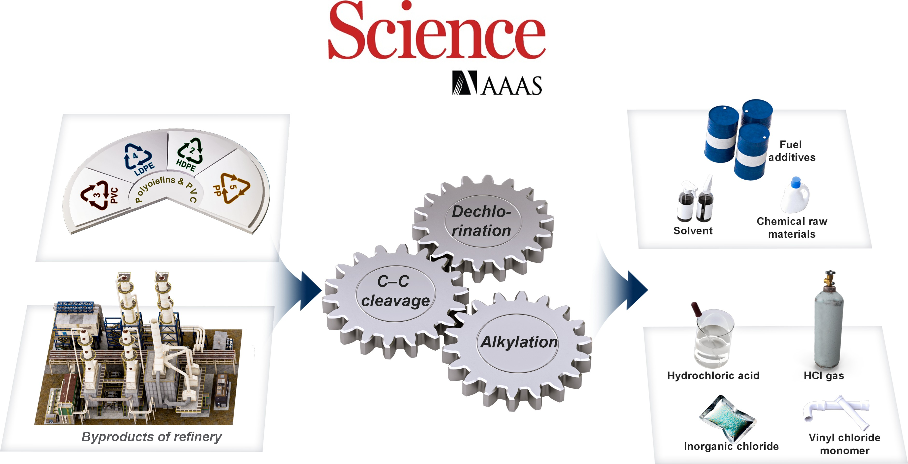

{width=80% fig-align="center"}

## Abstract
Polyolefins and their chlorinated derivatives such as polyvinyl chloride(PVC) are among the most prevalent plastics in global production and waste streams. Traditional waste-to-energy methods such as incineration and pyrolysis, as well as most chemical upcycling methods for PVC utilization, require thorough, high-temperature dechlorination to prevent the release of toxic chlorinated compounds. We present here a strategy for upgrading discarded PVC into chlorine-free fuel range hydrocarbons and hydrogen chloride in a single-stage process catalyzed by chloroaluminate ionic liquids. This approach offsets endothermic dechlorination and carbon-carbon bond cleavage with exothermic alkylation and hydrogen transfer by isobutane or isopentane in a low-temperature tandem process. The light isoalkanes are available from refinery processes and partly from recycling of the product stream. This process is suitable for handling real-world mixed and contaminated PVC and polyolefin waste streams.

## Cite as
W. Zhang,* B. Yang, B. Jackson, J. Zhao, H. Shi, D. Camaioni,  S. Kim, H. Wang, J. Szanyi, M. Lee, J. G. Chen and J. A. Lercher*, Integrating Low-temperature PVC and Polyolefin Upgrading. 2025, Science. In press.
