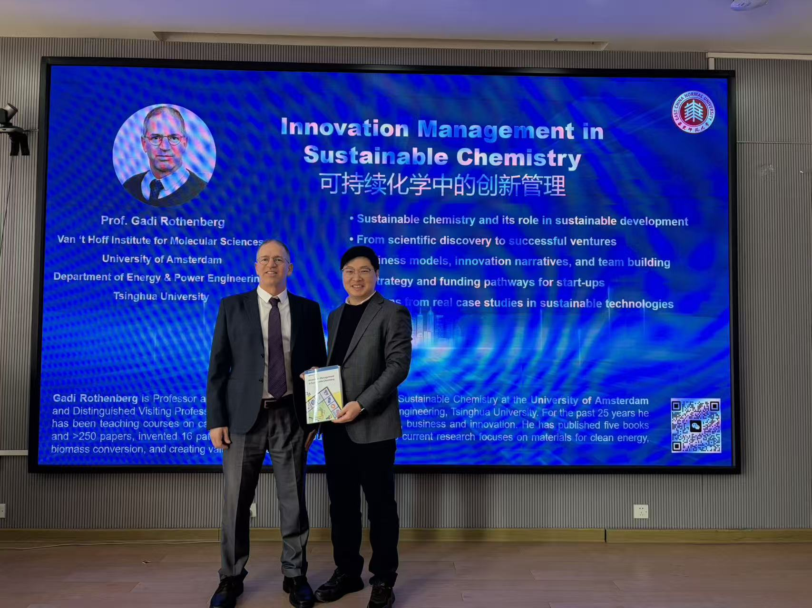

{width=80% fig-align="center"}

## Abstract
We were delighted to welcome **Prof. Gadi Rothenberg (University of Amsterdam)** to visit our laboratory. Prof. Rothenberg, who is also my **PhD supervisor**, delivered a seminar on how scientific discoveries in **sustainable chemistry** can be translated into successful business ventures. The lecture covered key principles of sustainable chemistry, innovation strategies, intellectual property and team formation, as well as funding pathways for sustainable start-ups.

## Homepage
[Gadi Rothenberg](https://hims.uva.nl/profile/r/o/g.rothenberg/g.rothenberg.html#Research-Interests--Philosophy) 